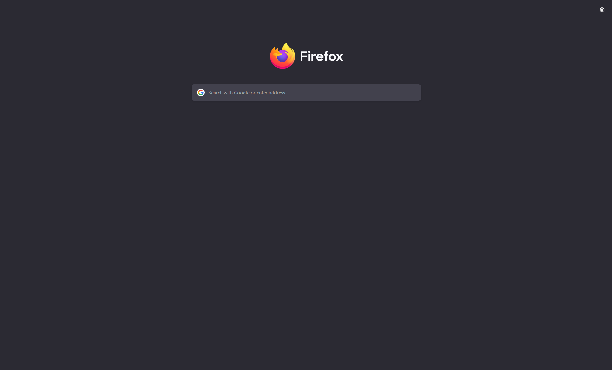
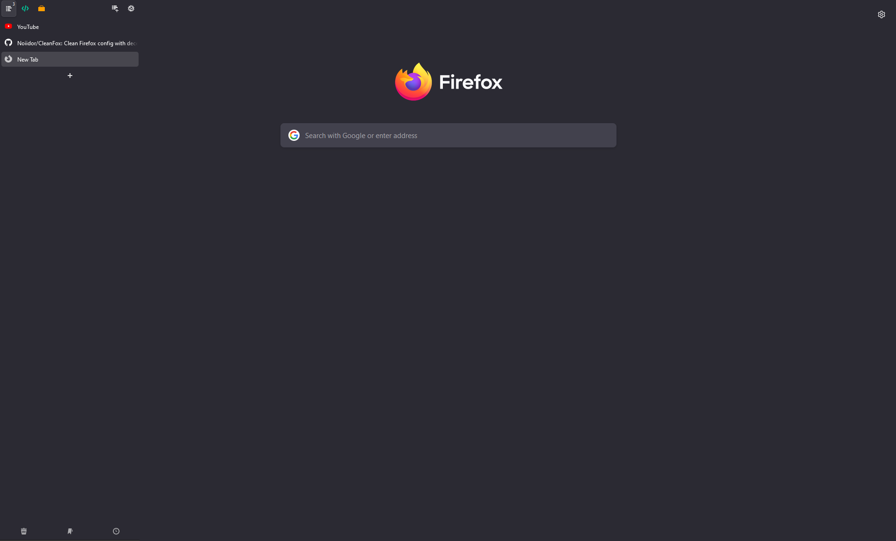
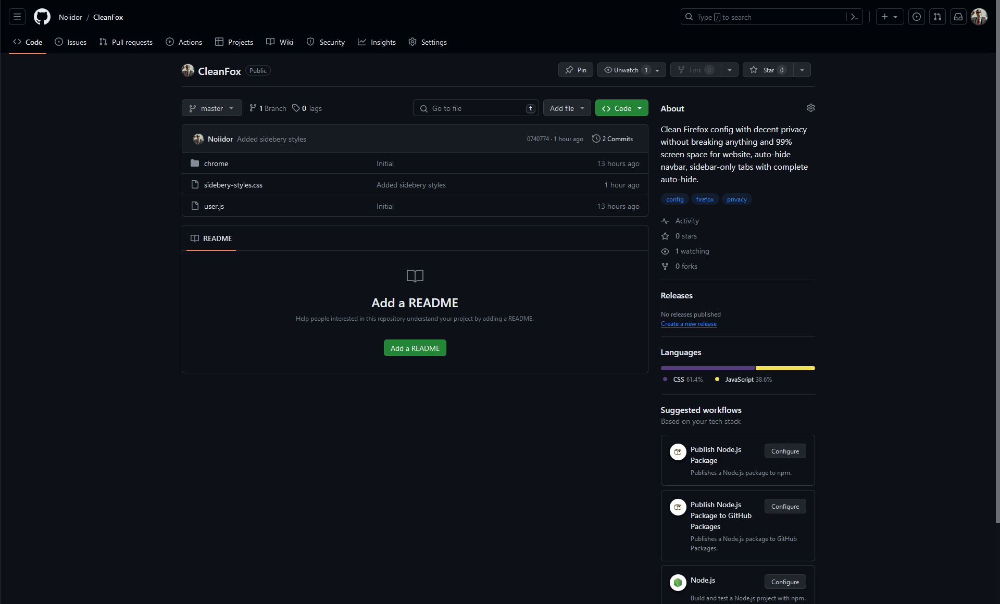
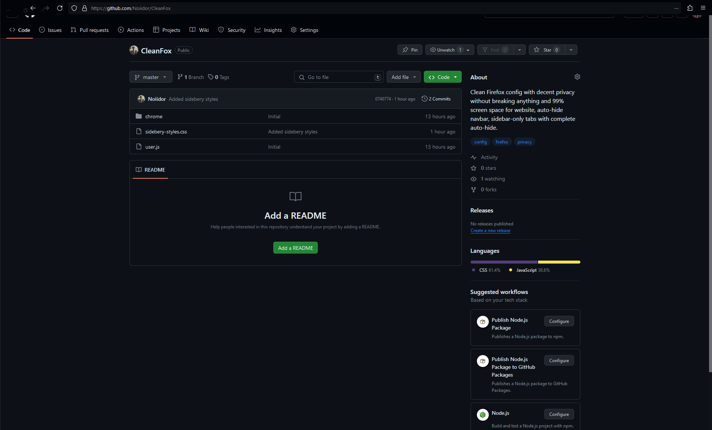
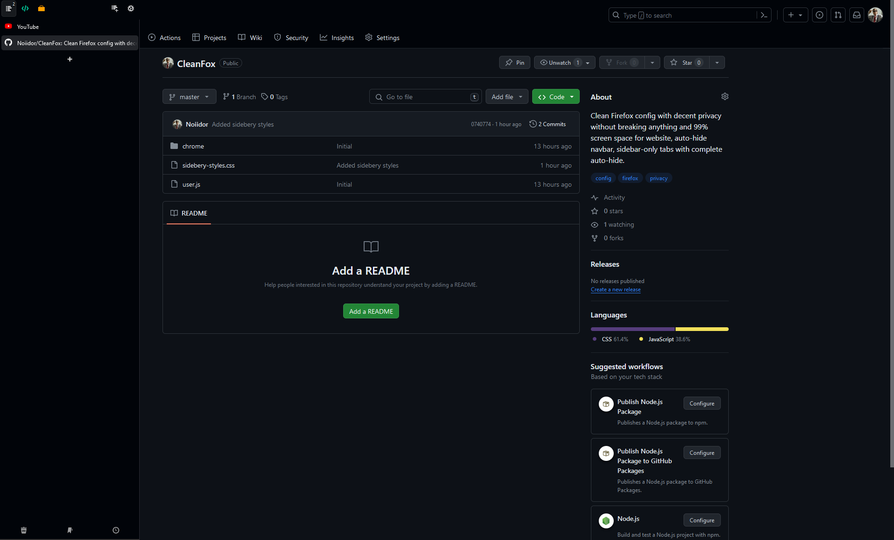

# CleanFox: Firefox Privacy and Convenience-aimed Config with 99% free screen space

### CleanFox is a pre-configured setup for Mozilla Firefox that provides decent privacy without breaking a single website and unique frameless browsing experience.

## Privacy

- **Strict Privacy:** Firefox default privacy level is set to strict.
  
- **Betterfox config:** user.js config almost without change was taken from [Betterfox](https://github.com/yokoffing/Betterfox).

## Auto-Hide Navbar and Sidebar

- **Auto-Hide Navbar:** CleanFox config have an auto-hide navbar feature that completely removes navbar when not focused.

- **Auto-Hide Sidebar:** Same as navbar, utilizing Sidebery extension sidebar for tabs 99% of time completely hidden from user.

- For bars to be visible you need to move cursor to edge of a screen(1px), or use keys shortcuts: Ctrl + L for navbar and configured keybinding in Sidebery settings.

## Required Extensions

- **Sidebery:** CleanFox requires Sidebery extension, because native tabs are completely disabled.

## Recommended Extensions

- **uBlock Origin:** Best open-source ad-blocker out there that can be configured for even more privacy.
- **Adaptiva Tab Bar Color:** Highly recommended, with this extensions sidebar and navbar will be colored according to current website color theme.

## Advices

- **Bookmarks:** Use Firefox`s Bookmarks function for quick access to frequently used websites through search bar, icons in Firefox default "New Tab" are disabled.

## Screenshots

